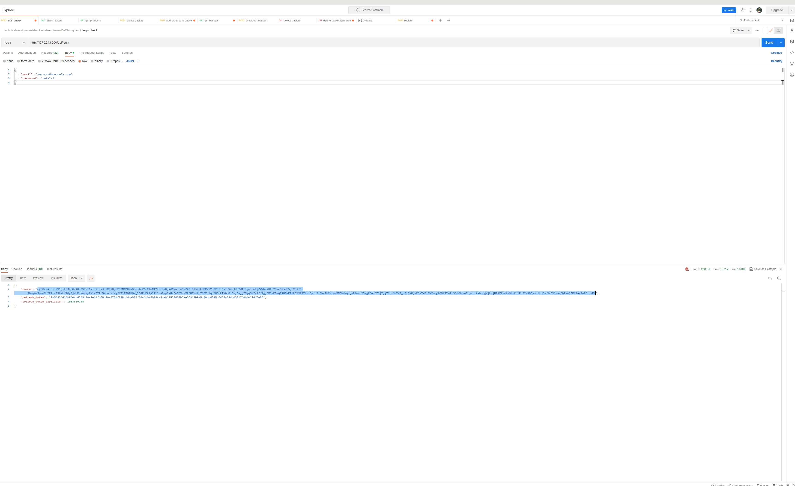
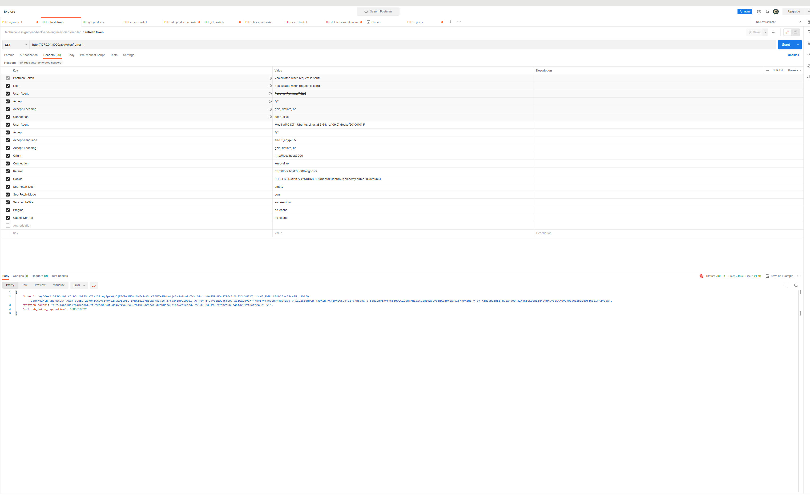
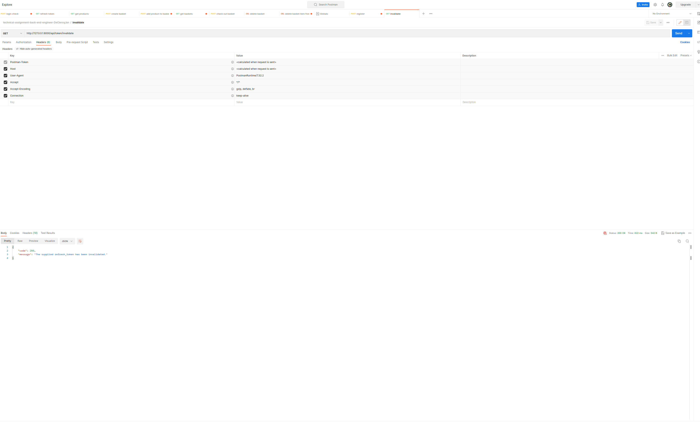
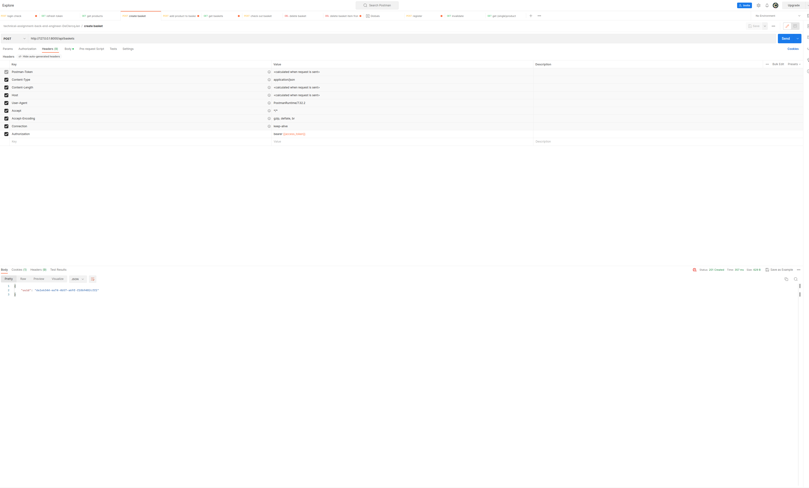
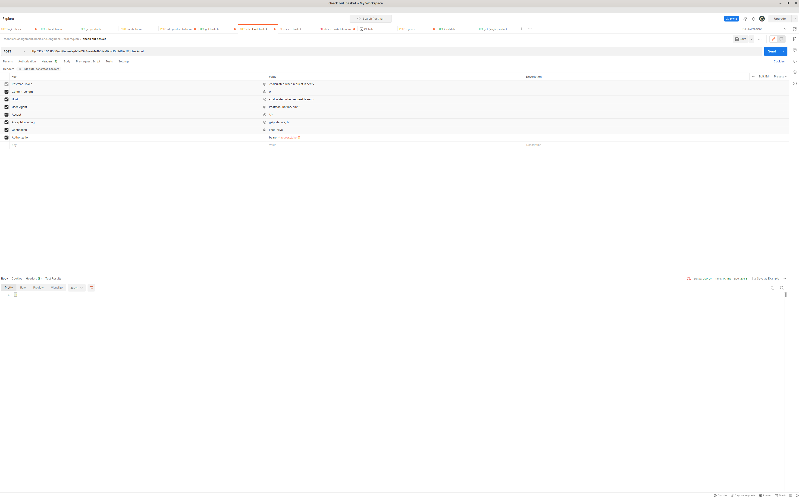
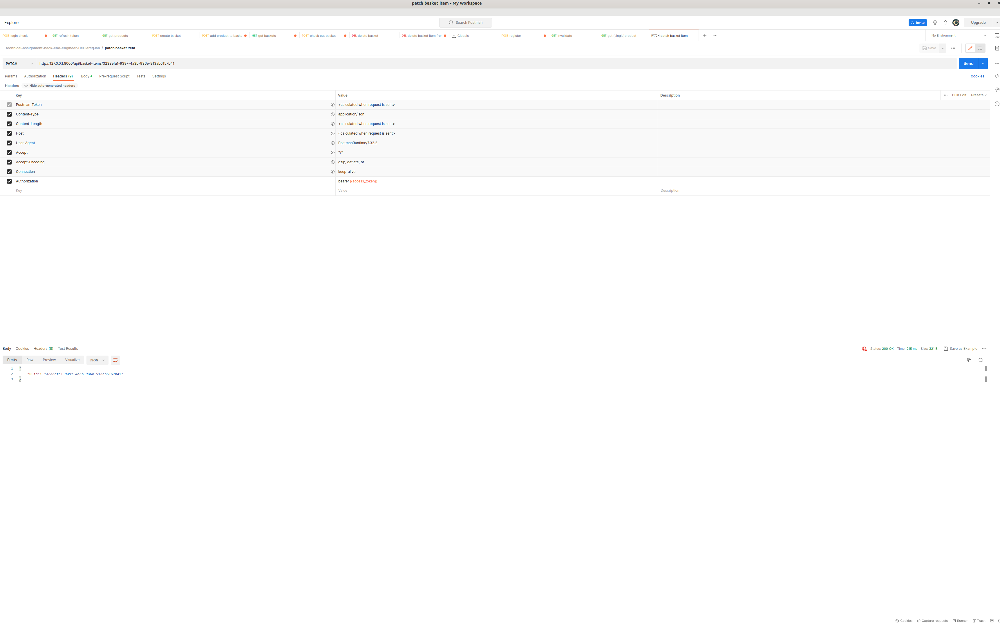

# Technical assignment back-end engineer

## Installation

### prerequisites

composer available in CLI. At least version 2.1

php version 8.2 locally installed.

commands below use symfony in CLI e.g. symfony console doctrine:migrations:migrate
atlernatively, you can use php bin/console doctrine:schema:validate but then you need to have php available and use a different webserver

### getting it to run

composer install

symony console lexik:jwt:generate-keypair

create a .env.dev.local file and fill out variables defined in .env

symfony console doctrine:database:create

symfony console doctrine:migrations:migrate

symfony server:start

symfony console --env=test doctrine:schema:create

symfony console doctrine:fixtures:load

### using it

to get list of all routes, run symfony console debug:routerF

create a user with password POST http://127.0.0.1:8000/api/register or use "hat@monopoly.com" + "hotels!"

login and get tokens POST http://127.0.0.1:8000/api/login

get new refresh token (remove old one) GET http://127.0.0.1:8000/api/token/refresh

you can also invalidate the refresh token GET http://127.0.0.1:8000/api/token/invalidate Note that the access token is not invalidated as this is not stored, but has a short enough lifespan (5 minutes)

now add (access) token to headers in following requests

get one of the product uuids via GET http://127.0.0.1:8000/api/products

create basket POST http://127.0.0.1:8000/api/baskets

use the uuid in the url of POST http://127.0.0.1:8000/api/baskets/da1e6344-ea74-4b57-a69f-f10b9482cff2/add-product and in the (json) body add the product uuid and set an amount. In the response you get a basket item uuid

check out a basket via POST http://127.0.0.1:8000/api/baskets/da1e6344-ea74-4b57-a69f-f10b9482cff2/check-out

update the amount of the basket item by PATCH http://127.0.0.1:8000/api/basket-items/3233efa1-9397-4a3b-936e-913ab6157b41

(soft) delete the basket item from the basket DELETE http://127.0.0.1:8000/api/baskets/da1e6344-ea74-4b57-a69f-f10b9482cff2/basket-items/3233efa1-9397-4a3b-936e-913ab6157b41

(soft) delete the basket itself DELETE http://127.0.0.1:8000/api/baskets/da1e6344-ea74-4b57-a69f-f10b9482cff2

to "know which items were added to a basket, but removed before checkout", there are 2 ways

easily get only the items that fulfil the criteria via GET http://127.0.0.1:8000/api/get-basket-items-removed-from-basket-before-checkout

or explore by using query the query parameters on GET http://127.0.0.1:8000/api/baskets

### running test

fill out (differentt DB in .env.test.local

symfony console --env=test doctrine:database:drop --force

symfony console --env=test doctrine:database:create

symfony console --env=test doctrine:migrations:migrate

symfony console --env=test doctrine:fixtures:load

php bin/phpunit

## Assignment

As part of an engineering team, you are working on an online shopping platform. The sales team wants to know which items were added to a basket, but removed before checkout. They will use this data later for targeted discounts.

Using the agreed upon programming language, build a solution that solves the above problem.

**Scope**

* Focus on the JSON API, not on the look and feel of the application.

**Timing**

You have one week to accomplish the assignment. You decide yourself how much time and effort you invest in it, but one of our colleagues tends to say: "Make sure it is good" ;-). Please send us an email (jobs@madewithlove.com) when you think the assignment is ready for review. Please mention your name, Github username, and a link to what we need to review.
